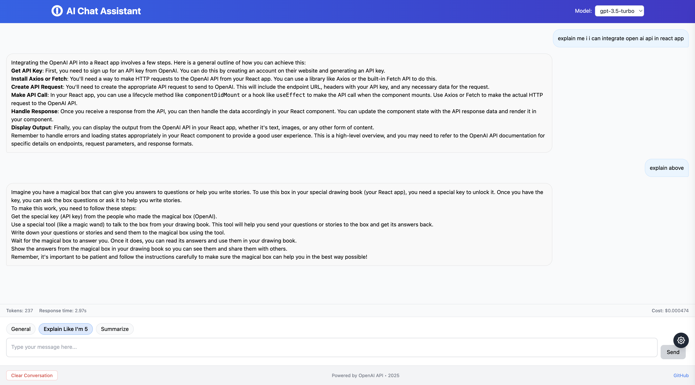

# AI Chat Assistant

A modern chat application built with React and Flask that integrates with OpenAI's API to provide an interactive AI assistant experience.



## Features

- Real-time streaming responses from OpenAI's API
- Multiple prompt templates (General, Explain Like I'm 5, Summarize)
- Token usage tracking and cost calculation
- Conversation history persistence
- Responsive UI with Tailwind CSS
- Settings panel for model selection and parameter adjustment

## Tech Stack

### Backend
- Flask: Python web framework
- OpenAI API: For generating AI responses
- Server-Sent Events (SSE): For streaming responses

### Frontend
- React: UI library
- TypeScript: Type-safe JavaScript
- Tailwind CSS: Utility-first CSS framework
- Axios: HTTP client

## Getting Started

### Prerequisites

- Node.js (v14+)
- Python (v3.8+)
- OpenAI API key

### Installation

1. Clone the repository:
```bash
git clone https://github.com/mishrapiyush30/ai-chat-app.git
cd ai-chat-app
```

2. Set up the backend:
```bash
# Create and activate a virtual environment
python -m venv venv
source venv/bin/activate  # On Windows: venv\Scripts\activate

# Install dependencies
pip install -r requirements.txt

# Create a .env file with your OpenAI API key
echo "OPENAI_API_KEY=your_api_key_here" > .env
```

3. Set up the frontend:
```bash
cd react-chat-bot
npm install
```

### Running the Application

1. Start the Flask backend (from the root directory):
```bash
source venv/bin/activate  # If not already activated
python app.py
```

2. Start the React frontend (in a separate terminal):
```bash
cd react-chat-bot
npm start
```

3. Open your browser and navigate to `http://localhost:3000`

## Project Structure

```
ai-chat-app/
├── app.py                 # Flask backend
├── requirements.txt       # Python dependencies
├── static/                # Static assets
├── templates/             # HTML templates
└── react-chat-bot/        # React frontend
    ├── public/            # Public assets
    └── src/               # Source code
        ├── components/    # React components
        ├── context/       # React context providers
        └── services/      # API services
```

## Usage

1. Select a model from the dropdown in the header
2. Choose a prompt template (General, Explain Like I'm 5, or Summarize)
3. Type your message in the input field and press Enter or click Send
4. View the AI's response in the chat window
5. Use the settings panel to adjust parameters like temperature and max tokens

## License

This project is licensed under the MIT License - see the LICENSE file for details.

## Acknowledgements

- [OpenAI API](https://openai.com/api/) for providing the AI capabilities
- [React](https://reactjs.org/) for the frontend framework
- [Flask](https://flask.palletsprojects.com/) for the backend framework
- [Tailwind CSS](https://tailwindcss.com/) for styling 